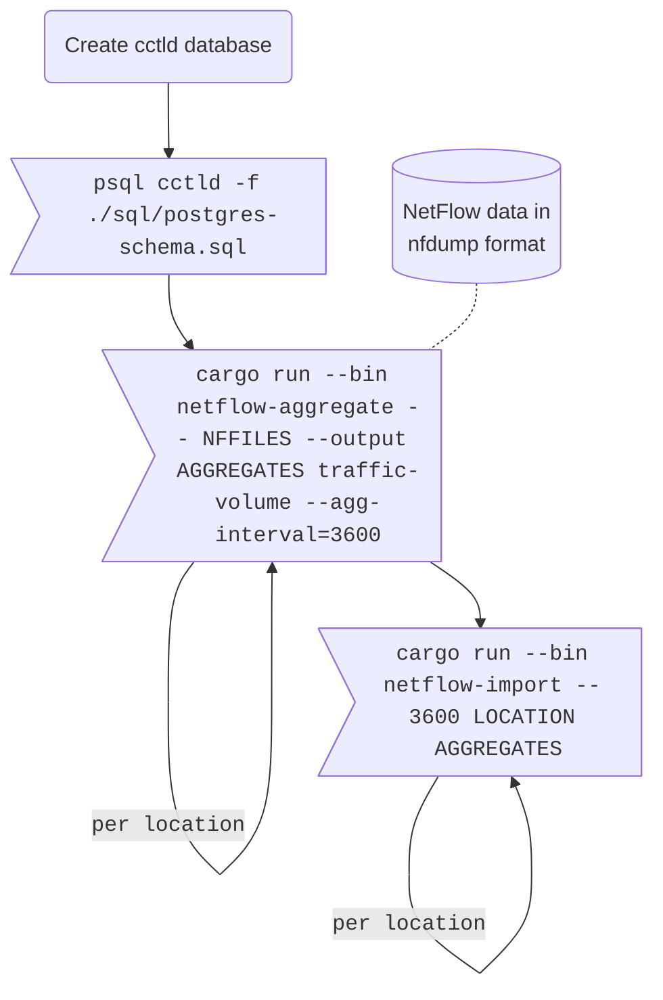

# Anomaly-based Filtering of Application-Layer DDoS Against DNS Authoritatives

This README accompanies the paper "Anomaly-based Filtering of Application-Layer DDoS Against DNS Authoritatives".
We publish the code to help reproducibility.
We cannot disclose the raw DNS query data, due to the sensitive nature of DNS name lookups and the national data protection laws.
Data sets to model different attackers based on the Mirai, Sality, and Open Resolver populations are available under [Data Sources](#data-sources).

The repository contains two programs.
There is a prototype, which ingests a NetFlow data file and computes an allowlist with traffic limitations per network range.
Furthermore, the complete pipeline for reproducing the paper evaluation is included as well.
The NetFlow data is aggregated and stored in a database to facilicate more extensive analysis.
From this data we can compute our allowlists (Section 4.2).
Based on the allowlist and the original traffic data, we simulate the impact our proposed filtering has on the benign and malicious traffic.

1. [Citations](#citations)
2. [Required Software](#required-software)
3. [Allowlist Prototype](#allowlist-prototype)
4. [Data Sources](#data-sources)
5. [Importing Data and Processing It](#importing-data-and-processing-it)
    1. [Importing NetFlow data into Postgres](#importing-netflow-data-into-postgres)
    2. [Further Data Aggregation](#further-data-aggregation)
    3. [Filtering Algorithm Parameter Optimization](#filtering-algorithm-parameter-optimization)
    4. [Generating Plots](#generating-plots)
6. [Contact Information](#contact-information)
7. [License](#license)

## Citations

If you make use of the code or data in this repository, please consider citing our conference paper.
You can use this Bibtex entry, use the [CITATION.cff](./CITATION.cff) file, or use the sidebar.

```bibtex
@inproceedings{DNSApplayerDDoSProtection,
    author    = {Jonas Bushart and Christian Rossow},
    month     = jul,
    year      = {2023},
    booktitle = {8th IEEE European Symposium on Security and Privacy},
    title     = {{Anomaly-based Filtering of Application-Layer DDoS Against DNS Authoritatives}},
    url       = {https://publications.cispa.saarland/id/eprint/3925},
    publisher = {{IEEE}},
    abstract  = {Authoritative DNS infrastructures are at the core of the Internet ecosystem.
                 But how resilient are typical authoritative DNS name servers against application-layer Denial-of-Service attacks?
                 In this paper, with the help of a large country-code TLD operator, we assess the expected attack load and DoS countermeasures.
                 We find that standard botnets or even single-homed attackers can overload the computational resources of authoritative name servers--even if redundancy such as anycast is in place.
                 To prevent the resulting devastating DNS outages, we assess how effective upstream filters can be as a last resort.
                 We propose an anomaly detection defense that allows both, well-behaving high-volume DNS resolvers as well as low-volume clients to continue name lookups---while blocking most of the attack traffic.
                 Upstream ISPs or IXPs can deploy our scheme and drop attack traffic to reasonable query loads at or below 100k queries per second at a false positive rate of 1.2\% to 5.7\% (median 2.4\%).},
}
```

## Required Software

We used the following tools for the project.

* Jupyter Lab
    * Jupytext
* nfdump
* Rust (stable)
* Postgres 11+
* Python 3.10

## Allowlist Prototype

The repository contains a prototype written in Python.
It depends on an existing [`nfdump`](https://github.com/phaag/nfdump/) installation.
Install `nfdump` either from source code or using your package manager.
Install the `ddos-filtering` tool with pip.

```bash
pip3 install git+https://github.com/dns-application-layer-ddos/dns-application-layer-ddos
```

**Usage:**

```text
usage: ddos-filtering [-h] [-c [CONFIG]] [-n NOW] [-o [OUTPUT]] FILES [FILES ...]

positional arguments:
  FILES                 nfdump files to process

options:
  -h, --help            show this help message and exit
  -c [CONFIG], --config [CONFIG]
                        Path to the configuration file
  -n NOW, --now NOW     The current time as RFC3339 string.
  -o [OUTPUT], --output [OUTPUT]
                        Path to write the allowlist as CSV. - for stdout.
```

The program needs one or multiple `nfdump` NetFlow files, and the timestamp up to which point it should generate the allowlist.
The allowlist can be written to stdout by using `--output -` or directly into a file with `--output <filename>`.
More options for traffic filtering and parameter tweaking are available in the [configuration file](./sample-config.jsonc).

## Data Sources

Together with the code used during evaluation, and the prototype, we further release the datasets on the simulated attackers.
This includes the data for the Mirai-like botnet, the Sality botnet, and open resolver.
All files are in the [./datasets](./datasets/) folder.

## Importing Data and Processing It

The complete pipeline for reproducing the main evaluation of the paper is described here.
It differs from the prototype in that it is more manual but allows for more flexibility in different analysis steps.
We will visualize the steps using simple flowcharts and use this convention for the steps.


### Importing NetFlow data into Postgres



First, we need to set up a Postgres database.
We create a database called `cctld` and grant the current user all permissions on it.
The basis schema is provided in the `./sql/postgres-schema.sql` file.

Next, we aggregate and import our set of `nfdump` NetFlow files.
We execute this step once per physical location.

All `cargo` commands should be executed with `--release` to achieve good performance.
We omit this flag from the flowcharts for brevity.

### Further Data Aggregation


Next we have a sequence of Postgres queries, which further aggregates the data into a usable format.
The `pre-test-intervals.sql` script creates temporary aggregates used in the next steps.
`allowlist.sql` computes the allowlist.
This step needs to be repeated once per location, but all locations can run in parallel.
`traffic-intervals.sql` computes the traffic occurring during different intervals.
This also needs to be repeated once per location.

### Filtering Algorithm Parameter Optimization

```mermaid
%%{init: { 'fontFamily': 'monospace' } }%%
flowchart TD
    classDef normal font-family:sans-serif;

    attackerips[(Attacker IPs<br>and strength)]:::normal
    catchment[(Full catchment<br>information)]:::normal

    grid>"cargo run --bin param-grid-search -- --attacker-ips ATTACKER_IPS --catchment CATCHMENT"]
    optimization>"cargo run --bin param-optimization -- --configuration CONFIGURATION EVAL_RESULTS"]
    evasion>"cargo run --bin param-grid-search -- --attacker-ips ATTACKER_IPS --catchment CATCHMENT --evasion-ips 1337"]
    evasioneval>"cargo run --bin param-evasion -- --configuration CONFIGURATION BASEDIR"]

    attackerips & catchment -.- grid & evasion

    grid --> optimization
    grid -. eval_results_*.json .- optimization
    optimization -. Best config .- evasion
    evasion --> evasioneval
    evasion -. eval_results_*.json .- evasioneval
```

With our populated database, we can now search for optimal algorithm parameters.
The parameters are set in the [`param-grid-search.rs`](./crates/evaluation/src/bin/param-grid-search.rs) file as constants.
You can update these to suit your needs.
Simulating a filtering run requires an attacker model.
This is specified by an external file, which lists the IP address of the attacker and how much traffic in relation to each other they can send.
This allows modelling an attacker with multiple attacking nodes of different strengths.
Additionally, a file describing the catchment of each location is necessary.
This describes for each IP range and each anycast IP address to which location the traffic is routed.
Multiple locations can be provided.

The output of `param-grid-search` is then further processed by `param-optimization` which can run a global optimization pass or day-forward-chaining.

Recreating the evasion simulation is possible with `param-grid-search` by providing the `--evasion-ips` arguments, which specifies how many of the attacker IPs are counted as having evaded detection.
These results are then processed by `param-evasion`.

Please check the top of the files, and the help text of each program for more details.

### Generating Plots

The [`notebooks`](./notebooks/) folder contains the scripts we used to generate the plots for our paper.
The scripts consume the `eval_results_*.json` files generated in the step above.
If further sources are needed, that is explained in the files.
Each `*.py` file is a Jupyter notebook in the percent format.
Each cell is separated by `# %%`.
You can use jupytext to convert it back into a `*.ipynb` notebook.

## Contact Information

You can contact the authors using the following details.
Further contact information is provided in the [CITATION.cff](./CITATION.cff) file.

**Jonas Bushart**  
mail: jonas . bushart [at] cispa . de *(remove spaces)*  
web: <https://bushart.org/>  

**Christian Rossow**  
mail: rossow [at] cispa . de *(remove spaces)*  
web: <https://christian-rossow.de/>

## License

The code and data is licensed under the BSD-3-Clause license.
For details of the license check the provided [LICENSE](./LICENSE) file.
